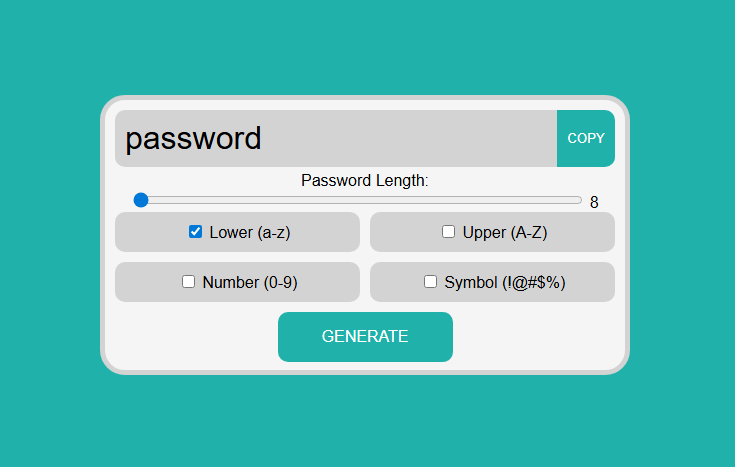

# Password Generator 🔐
 
This is a simple password generator I built using HTML, CSS, and JavaScript. It lets you generate strong, random passwords by selecting the type of characters you want (lowercase, uppercase, numbers, symbols) and setting your desired password length.

Perfect if you just need a quick, secure password without relying on third-party tools.

---

## 📂 Project Structure

```
password-generator/
├── assets/
│   └── screenshot.png
├── src/
│   ├── index.html
│   ├── style.css
│   └── script.js
├── LICENSE
└── README.md
```
---

## 🔍 How it Works

Just select the options you want:

- ✅ Lowercase letters  
- ✅ Uppercase letters  
- ✅ Numbers  
- ✅ Symbols

Then set the password length and hit **Generate**. You’ll instantly get a password, and you can copy it with one click.

---

## 🧠 How It Actually Works (The Logic)

Once you choose the options — like lowercase, uppercase, numbers, or symbols — the script puts together a pool of characters based on those choices.

Then, it just randomly picks characters from that pool to build the password.

Here’s a simplified version of the logic in JavaScript:

```javascript
let characters = "";

// Build character set based on selected options
if (lowercase is checked) characters += "abcdefghijklmnopqrstuvwxyz";
if (uppercase is checked) characters += "ABCDEFGHIJKLMNOPQRSTUVWXYZ";
if (numbers is checked) characters += "0123456789";
if (symbols is checked) characters += "!@#$%^&*+=";

// Generate password
let password = "";
for (let i = 0; i < desiredLength; i++) {
  const index = Math.floor(Math.random() * characters.length);
  password += characters[index];
}
```
---

## 📸 Screenshot



---

## 🔗 Live Demo  
👉 [Click here to try it out](coming soon)

---

## 🚀 Tech Used  
- HTML  
- CSS  
- JavaScript (Vanilla)

---

## 📁 Files  
- `index.html` – main HTML file  
- `style.css` – styles and layout  
- `script.js` – handles logic and functionality  
- `screenshot.png` – image used in this README 

---

## 💡 Why I Built This

I made this project mainly to practice working with DOM manipulation and handling user inputs in JavaScript.  
It was also a fun way to create something useful — I always need strong passwords, so I figured why not build my own generator?

Along the way, I got more comfortable with conditionals, event listeners, and dynamic UI logic.  
It's simple, but solid — and I'm proud of how it turned out.

---

## ✍️ Author  
**Mohd Rayyan**  

Feel free to connect or drop feedback, always up for learning more and improving things.

---

## 📝 License

This project is licensed under the **MIT License**.  
Feel free to use, modify, or share — just give proper credit.

You can read the full license [here](LICENSE)

